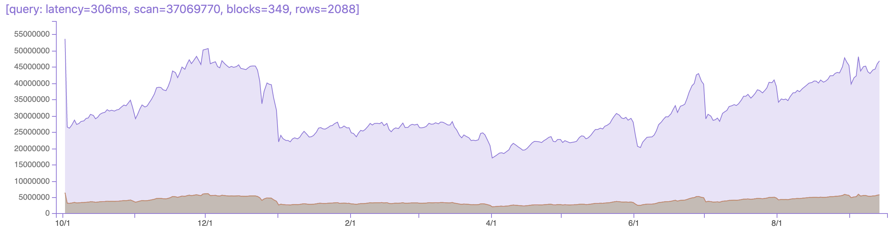
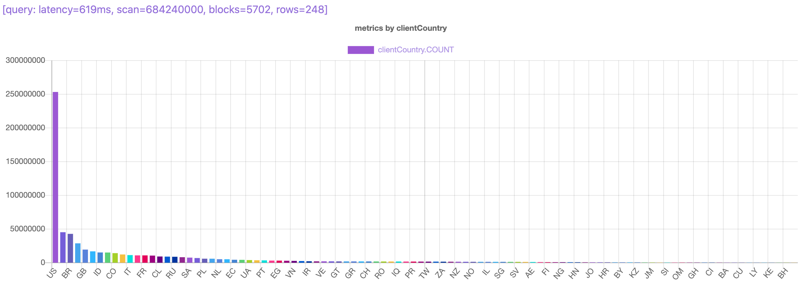
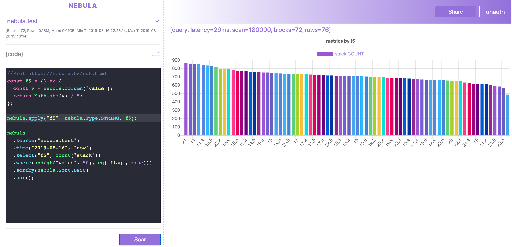

# Nebula
**Extremely-fast Interactive Big Data Analytics**

[](https://shawncao.medium.com/introduce-nebula-62d6e17dfaeb) <br>
Nebula is an extremely-fast end-to-end interactive big data analytics solution.
Nebula is designed as a high-performance columnar data storage and tabular OLAP engine.

It can do much more than these:
- Extreme Fast Data Analytics Platform.
- Column Level Access Control Storage System.
- Distributed Cache Tier For Tabular Data.

Documents of design, internals and stories will be shared at [project site](https://nebula.bz).

## Demo
### 10 minutes video
[](https://youtu.be/Fwevde7iBws "Nebula Demo")

### generating bar chart from 100GB data in 600ms


### Write an instant javascript function in real-time query.



# Get Started
## Run It!
- clone the repo: `git clone https://github.com/varchar-io/nebula.git`
- run run.sh in source root: `cd nebula && ./run.sh`
- explore nebula UI in browser: `http://localhost:8088`


## Build Source
Please refer [Developer Guide](./dev.md) for building nebula from source code.
Welcome to become a contributor.

# Use Cases
## Static Data Analytics
Configure your data source from a permanent storage (file system) and run analytics on it. 
AWS S3, Azure Blob Storage are often used storage system with support of file formats like CSV, Parquet, ORC. 
These file formats and storage system are frequently used in modern big data ecosystems.

For example, this simple config will let you analyze a S3 data on Nebula
```yaml
seattle.calls:
  retention:
    max-mb: 40000
    max-hr: 0
  schema: "ROW<cad:long, clearence:string, type:string, priority:int, init_type:string, final_type:string, queue_time:string, arrive_time:string, precinct:string, sector:string, beat:string>"
  data: s3
  loader: Swap
  source: s3://nebula/seattle_calls.10k.tsv
  backup: s3://nebula/n202/
  format: csv
  time:
    type: column
    column: queue_time
    pattern: "%m/%d/%Y %H:%M:%S"
  settings:
    # csv delimiter - it defaults to tab key, so have to specify
    # try to use tab rather than comma - nebula CSV reader may have bug if column value contains comma
    # csv.delimiter: ","
    # the data has header - it defaults to true hence can be ommited.
    csv.header: true
```

## Realtime Data Analytics
Connect Nebula to real-time data source such as Kafka with data formats in thrift or JSON, and do real-time data analytics.

For example, this config section will ask Nebula to connect one Kafka topic for real time code profiling.
```yaml
  k.pinterest-code:
    retention:
      max-mb: 200000
      max-hr: 48
    schema: "ROW<service:string, host:string, tag:string, lang:string, stack:string>"
    data: kafka
    topic: <topic>
    loader: Roll
    source: <brokers>
    backup: s3://nebula/n116/
    format: json
    columns:
      service:
        dict: true
      host:
        dict: true
      tag:
        dict: true
      lang:
        dict: true
    time:
      # kafka will inject a time column when specified provided
      type: provided
    settings:
      batch: 500
```

## Ephemeral Data Analytics
Define a template in Nebula, and load data through Nebula API to allow data live for specific period. 
Run analytics on Nebula to serve queries in this ephemeral data's life time.

## Sparse Storage
Highly break down input data into huge small data cubes living in Nebula nodes, usually a simple predicate (filter) will massively 
prune dowm data to scan for super low latency in your analytics.

For exmaple, config internal partition leveraging sparse storage for super fast pruning for queries targeting specific dimension:
(It also demonstrates how to set up column level access control: access group and access action for specific columns)
```yaml
  nebula.test:
    retention:
      # max 10G RAM assigment
      max-mb: 10000
      # max 10 days assignment
      max-hr: 240
    schema: "ROW<id:int, event:string, tag:string, items:list<string>, flag:bool, value:tinyint>"
    data: custom
    loader: NebulaTest
    source: ""
    backup: s3://nebula/n100/
    format: none
    # NOTE: refernece only, column properties defined here will not take effect
    # because they are overwritten/decided by definition of TestTable.h
    columns:
      id:
        bloom_filter: true
      event:
        access:
          read:
            groups: ["nebula-users"]
            action: mask
      tag:
        partition:
          values: ["a", "b", "c"]
          chunk: 1
    time:
      type: static
      # get it from linux by "date +%s"
      value: 1565994194
```


## Nebula Is Programmable
Through the great projecct QuickJS, Nebula is able to support full ES6 programing through its simple UI code editor.
Below is an snippet code that generates a pie charts for your SQL-like query code in JS.

On the page top, the demo video shows how nebula client SDK is used and tables and charts are generated in milliseconds!

```javascript
    // define an customized column
    const colx = () => nebula.column("value") % 20;
    nebula.apply("colx", nebula.Type.INT, colx);

    // get a data set from data set stored in HTTPS or S3
    nebula
        .source("nebula.test")
        .time("2020-08-16", "2020-08-26")
        .select("colx", count("id"))
        .where(and(gt("id", 5), eq("flag", true)))
        .sortby(nebula.Sort.DESC)
        .limit(10)
        .run();
```

# Open source
Open source is wonderful - that is the reason we can build software and make innovations on top of others.
Without these great open source projects, Nebula won't be possible: 

- GRPC:     [network/communication](https://github.com/grpc/grpc)
- Folly:    [algo/concurrency](https://github.com/facebook/folly)
- QuickJS:  [fast/compact/embeded JS engine](https://github.com/bellard/quickjs)
- Protobuf: [protocol buf - define interfaces](https://github.com/protocolbuffers/protobuf)

Many others are used by Nebula:
- common tools (glog/gflags/gtest/yaml-cpp/fmt/leveldb)
- serde (msgpack/rapidjson/rdkafka)
- algos(xxhash, roaring bitmap, zstd, lz4)
- ...
