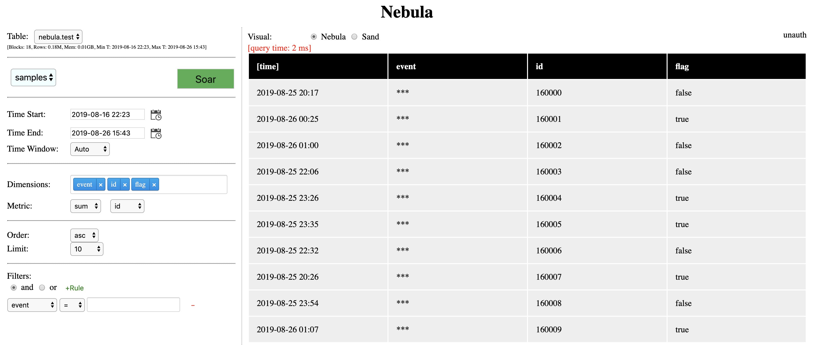
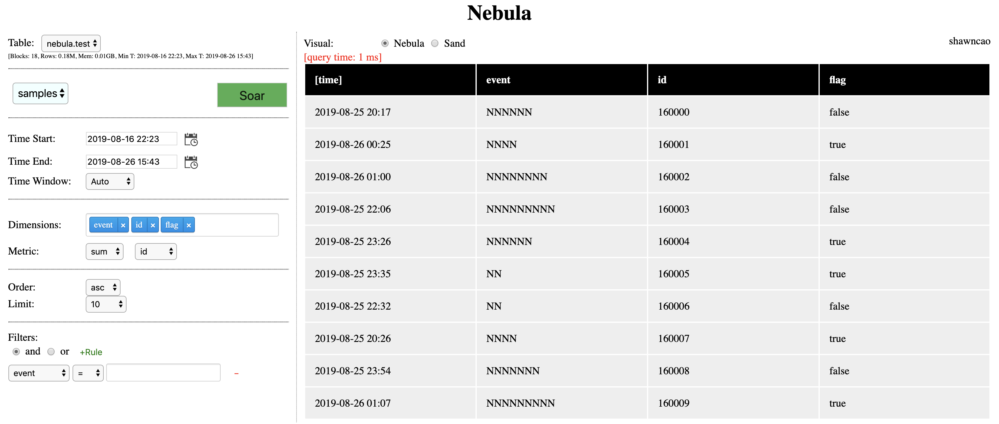

# Security - Access Control: Table Level & Column Level Access Control
**Nebula** is born for serving critical data tranfer between *Compute* and *Storage*, working as generic data gateway in normal data warehouse setup.

Even though it is one shiny data analytics platform, it never forgets its first mission as of "securing data access". So let's talk about how access control works in Nebula and what is already working today. 

## Authentication, Identity, Token & Access Check
To get access control in effect, Nebula expects user idenity and security settings provided through its access point, such as Nebula Web/Api layer. In the test deployment, I use envoy + oAuth authentication server to get current user's ID and its security groups managed by LDAP. In different setup, you may use security token instead to represent the security passport sent to Nebula, which is out of the scope of Nebula.

Nebula maintains framework to plugin in access check providers so that it make service call to decide action upon any object access at table level as well as column level. 

Nebula itself also implements a default rule engine provider to provide config based access check. An example will be shown later on.

## Workflow
Again, I use my rough hand drawing to show the workflow of one example setup.


In the illustration, Nebula Web/Api gains user ID and LDAP groups and they are passed through Nebula Server through service call (gRpc).
- User Name (text)
- User Security Groups (a hash set)

Nebula Server analyze current query, it does 3 passes of check from bird eyes' view
1. Auth is required or not: this is cluster level setting, which indicates if current deployment requires authentication or not. If yes, every single query to Nebula will require user security identity to be present, otherwise it will fail every single request.
2. Table level access control: you can define as many as access rules for each table, Nebula will go through these rules and ensure every rule is satisfied, if not, it will end up on the action to take. 
3. Similar like table level, you can define as many as access rules for each column. Any rule violation will end up with its desired action, if multiple violation happens, the strongest action will take a lead.

Unless everything gives a "green" pass from above check, the query will not be executed, and an error message will be returned to client. 


## Nebula Config Based Rules Engine
While **Nebula** supports any external rules engine to provide access check service, its own config based rules engine may be suitable for most of use cases, as it is safe, native and co-deployed inside Nebula service.

Here is one example: 

This config snippet is found in one table definition in cluster.yaml
```yaml
    columns:
      id:
        bloom_filter: true
      event:
        access:
          read:
            groups: ["nebula-users"]
            action: mask
```
It places one access rule on column "event", what it says is: to read column "event", the user needs to be in group "nebula-users", if violates, the query can continue, but all event column value will be masked ("***" for string type column and "0" for numeric typed column).

For instance, this "unauth" user doesn't satisfy the rule setting, it's query result looks like this


When I switch to an user (shawncao) who has the correct security group membership, and I can see the values now:


Another exmaple showing you can place the same "access" config under table rather than column to provide table level access control:

```yaml
    nebula-test:
      retention:
        max-mb: 10000
        max-hr: 240
      access:
        read:
          groups: ["nebula-super"]
          action: deny
```
This rule tells Nebula to deny any user queries if it is not in security group "nebula-super".

Nebula not only support access control on READ, it also supports access control on Aggregation. For example:
```yaml
    columns:
      revenue:
        access:
          read:
            groups: ["nebula-super"]
            action: mask
          aggregate:
            groups: ["nebula-users"]
            action: deny
```
This rule tells, the user has to be in security group "nebula-super" to be able to query column "revenue", otherwise, it will be masked means user will not able to read its value. It also requires user to be in group "nebula-users" to be able to run aggregation on this column, if not, any query tries to aggregate (count, sum, avg, ...) this colummn will fail, no execution allowed.

## Non-Secure Deployment
If security / access control, or even authentication is not something interest you, just turn off completely by set "auth" to false in your cluster config file (eg. cluster.yaml).

A sample view: 
```yaml
version: 1.0

# server configs
server:
  # as node will treat server to run as a node
  # if false, server will not load any data in itself.
  # NOTE that, there are maybe missing functions to fully compatible for server as node.
  # such as task execution may not be implemented.
  anode: false

  # this field indicates if current deployment requires auth or not
  # if set as true, auth (such as oAuth) is required to set up to make query executable
  auth: false
```


Hope this post helps you understand what access control looks in Nebula. 

Cheers!