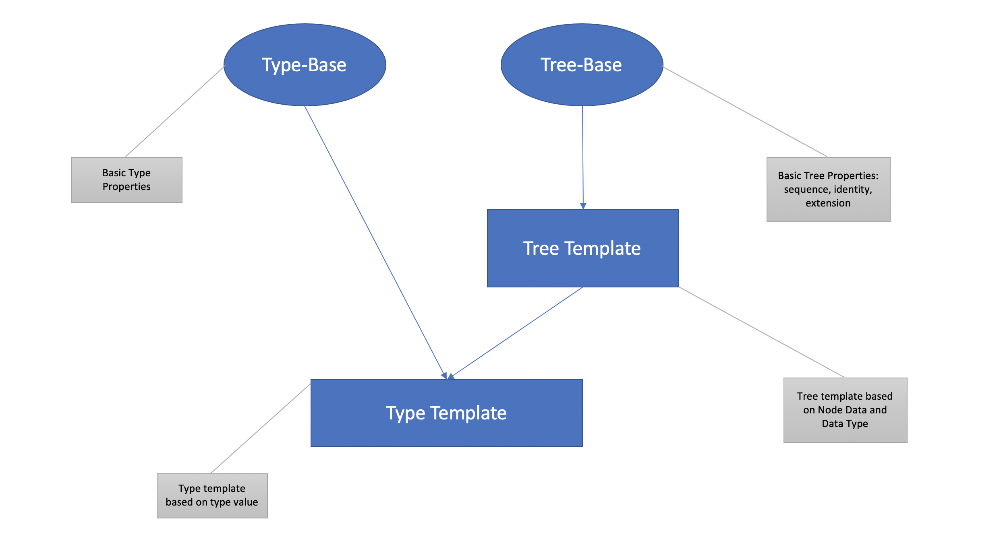

# Overview
**Nebula** is a _block based data engine_ designed for optimizations on
* Extremely Fast Data Analytics.
* Tiered Data Storage.
* Secured Data Surface.

I would like to highlight a few top advantages that **Nebula** is presenting
1. Hybrid columnar storage: depending on scenarios, **Nebula** dynamically switches between row-format and columar format data layout for speeding up computing or maximize throughput. For scenarios like data anonymization or data masking, **Nebula** may even choose pure columnar storage to minimize delta update to alter a specific column data.
2. Comprehensive meta data system: meta data system is the brain of the whole system, query optimization, tiered data placement strategy and all other data synchronization are heavily depending on meta data system.
3. Dynamic compression/encoding: to fit different access pattern, apply dynamic compression/encoding on different data for best compute efficiency and storage efficiency balance.
4. Query interface and streaming interface: no matter it's analytics use case or data streaming use cases. The unified input as query interface, while unified output as streaming interface.


# Architecture

To fit Nebula into the most common big data system, it could be partially illustrated as:


***

## Security & Privacy

> For an organization, one of the most specific needs in big data system comparing to others is security and privacy requirements.
>
> Connecting with the organization's authentication and authorization system is highly customized in Nebula.
> It operates as plugin model with a common interface. 

### Column Level Access Control
### Data Anonymization
### Data Masking
### Data Encryption

## Query System
At the topmost layer, Nebula provide a SQL like DSL API for client to build up queries.
A query can then be planned and sent to all nebula nodes to execute.
It's easy to introduce SQL language as user interface to compile a text-based query into this API.

Query Planner will take this query object, compile it into an execution plan to execute.
A code snippet showing how to build a query object.

```cpp
const auto query = table(tbl, ms)
                      .where(like(col("event"), "NN%"))
                      .select(
                        col("event"),
                        col("flag"),
                        max(col("id") * 2).as("max_id"),
                        min(col("id") + 1).as("min_id"),
                        count(1).as("count"))
                      .groupby({ 1, 2 })
                      .sortby({ 5 }, SortType::DESC)
                      .limit(10);
```

### Query Execution
(Placeholder)
- Execution Model
- CPU cache friendly memory management
- Vectorization and SIMD

### UDF
- built-in UDFs
- user-provded Javascript based UDF
  - V8 engine integration


### Visualization

### JOIN  
(future plan)

## Streaming Interface
Nebula supports streaming data over gRPC/HTTP2 stack of given query in below format
- Exchangable Data Format
  - (NBlock) Nebula Block
  - Arrow: high exchangable across multiple languages.
- JSON
  - Optimization for light weight data to build UI
- Protobuf
  - Optimization for application clients


## Type System
Nebula treat schema as a type tree. Each leaf node is a primitive data node.
Non-leaf nodes represents compound types such as struct, list and map.
This type system is compatible with hadoop supported data schemas.



## Metadata System
(Placeholder)

## Data Encoding Options
Nebula applies different compression and encodings to different data to achieve least cost of memory consumption while achieve best compute efficiency.

Here is a list of encodings available for data.

| Type          | Encodings         | Metadata |
|:--------------|:------------------|:------|
| bool          | compressed bitmap | NULL-MAP  |
| integers      | RLE, delta   | min/max/count/sum/HLL  |
| string        | dictionary, inverted index      | index/histogram  |


# Ingestion
(Placeholder: Data Ingestion)

# Cluster Management
(Placehodler: ETCD/ZOOKEEPER/NATIVE)

## Replica and Data Redundancy

# Fault Torelance and Latency Uplimit

