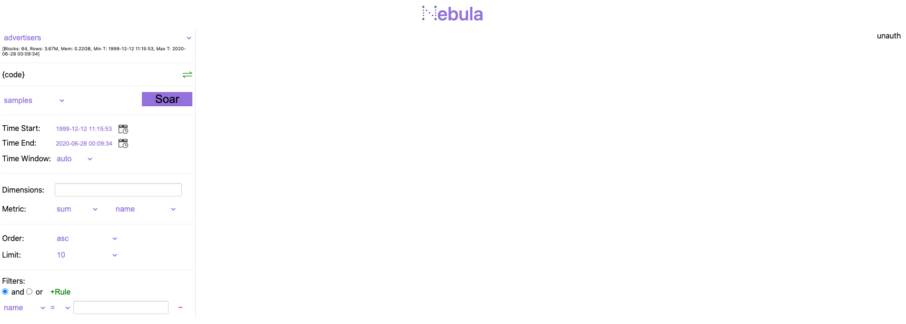
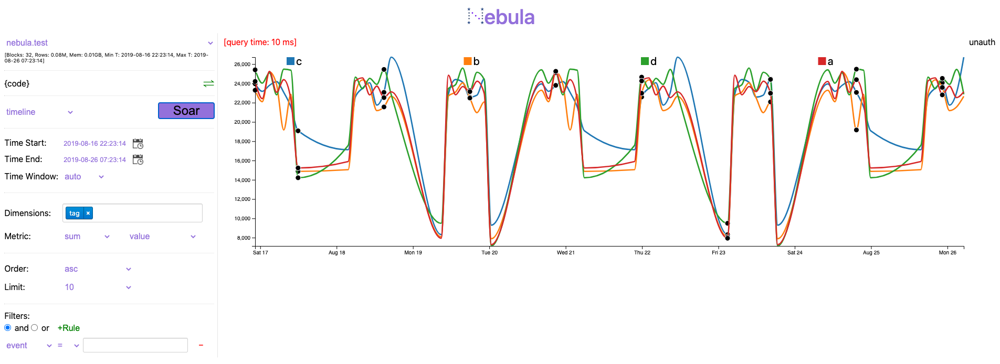
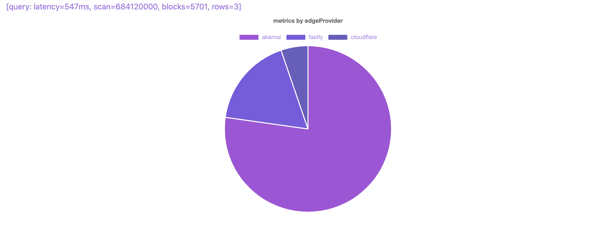
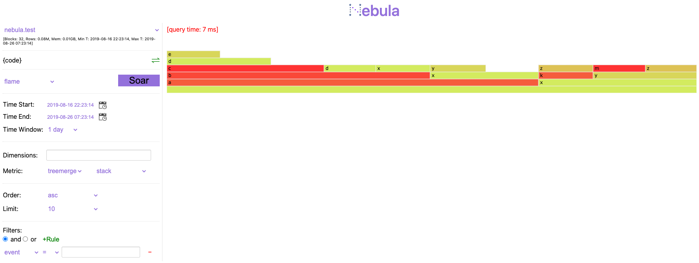

# Get Started With Docker Build
Nebula has published its components to docker hub in a public repository.
This instructions will show you how to get a test data set run with Nebula on your local host as single node cluster.

## Quick Steps
0. Clone "Nebula" repo. And assume you're in ~/nebula/test directory.
1. Edit [cluster config](local-cluster.yml) by put current host as the one only node.
> or run `sed -i "s/<hostname>/$HOSTNAME/g" local-cluster.yml`
2. Run Nebula
> ./local-run.sh
3. Check it out through Nebula UI at: http://&lt;hostname&gt;:8088

## Explore Nebula Through Its UI
You should be able to see something like this

From here, you can query the selected table (nebula-test for demo) for different visualizaitons.
1. Timeline Of Nebula Test Entries

2. Table Aggregation By "Event" Column

3. Pie Chart Of Event Distribution By Count

4. Using Nebula Analyzing Perf

## Filters / Metrics
Try to apply different filters in your query. 
Try different metrics in query.

## Large Request via POST
Sometimes, the query include large request data, such as a query check if a column in a list of values, and the list is huge.
Then Nebula UI is probably not able to encode all request data in its URL. 

Nebula can support such query through CURL at API level, Nebula UI will support POST method in the future.

As a demo how to use it to fetch data. Prepare the query in a JSON file, like example [post.json](./post.json).
Here is how a curl command to query it, use my dev server as host
> curl -N -i -X 'POST' -H 'content-type:application/json' -d @post.json 'http://dev-shawncao:8088/?api=query&start=0&end=0'
